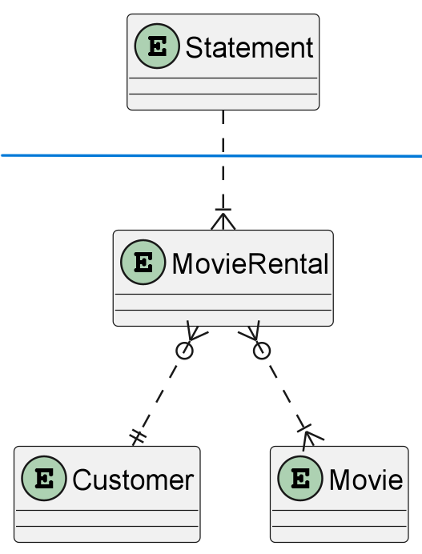

# Refactoring Java

The code creates an information slip about movie rentalItems.
Rewrite and improve the code after your own liking.

Think: you are responsible for the solution, this is a solution you will have to put your name on.


## Handing in the assignment

Reason how you have been thinking and the decisions you took. 
You can hand in the result any way you feel (git patch, pull-request or ZIP-file).
Note: the Git history must be included.


## To run the test:

```
javac src/*.java
java -cp src Main
```

## Assumptions

1. Scope of application is to generate rental statements for active rentals of a given customer.
2. Some other service(ex. movie-rental-app) handles the movie renting and data persistence.
3. Information model for the "movie-rental" service is,



4. Contract to access rental data from a repository or other service is ```MovieRentalRepository.java```.

## Decisions

1. Main class remains unchanged for quick testing.
2. Returns a ```RentalStatement.java``` instead of a text with a specific format.

## Git Repository

https://github.com/imesheadikari/refactoring-java-master
